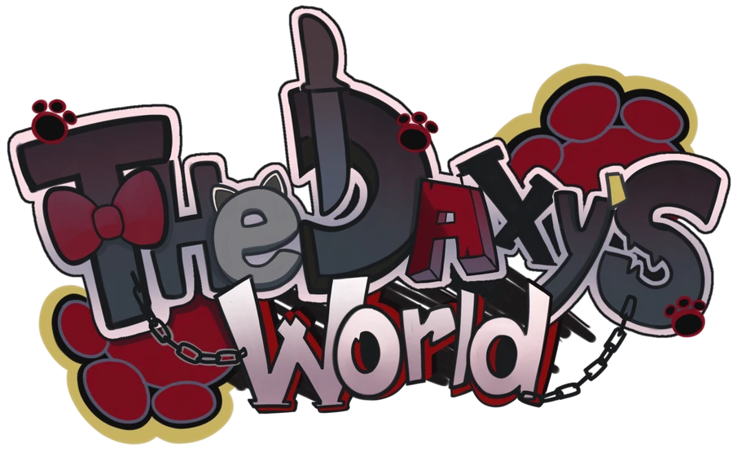
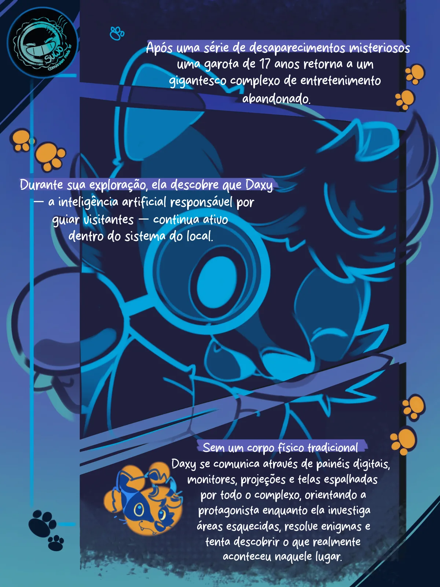
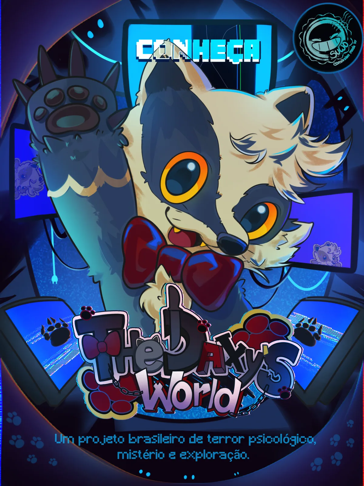
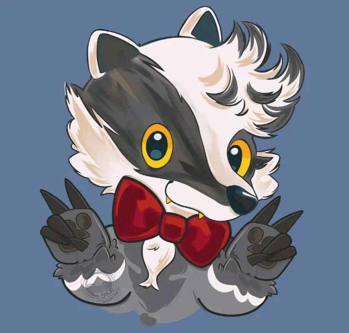

<p align="center">
  
</p>

<h1 align="center">The Daxy's World</h1>

<p align="center">
  <i>Um parque de entretenimento infantil abandonado. Uma garota de 17 anos.<br>
  E uma inteligência artificial que nunca aprendeu a dizer adeus.</i>
</p>

<p align="center">
  <a href="https://www.tiktok.com/@lunaryn.studios">TikTok @lunaryn.studios</a> ·
  <a href="https://instagram.com/suwo.0">Arte por SuwO</a>
</p>

<p align="center">
  
  
  
</p>

---

Este repositório contém o **site oficial de apresentação** de *The Daxy's World*, um jogo brasileiro de **terror psicológico** e **mascot horror**, feito em Unreal Engine 5 pela **Lunaryn Studios**.

## Sobre o jogo

Depois de uma série de desaparecimentos misteriosos, uma garota de 17 anos retorna a um gigantesco parque de entretenimento infantil abandonado — o mesmo lugar onde tudo começou.

Durante a exploração, ela reencontra **Daxy**, a inteligência artificial responsável por recepcionar e guiar os visitantes do parque. Sem corpo físico, Daxy se comunica através de painéis, monitores e projeções espalhados pelo complexo, que nunca ficou realmente vazio.

Explorando setores esquecidos, resolvendo quebra-cabeças e encontrando documentos abandonados, a protagonista percebe que aquele lugar guarda uma história bem mais sombria do que um parque de diversões deveria guardar. E Daxy também está mudando.

> *"Bem-vindo(a) de volta! Faz tempo que ninguém vinha nos visitar."* — Daxy

<p align="center">
  
  
  
</p>

| | |
|---|---|
| **Gênero** | Terror psicológico · Mascot horror |
| **Engine** | Unreal Engine 5 |
| **Plataforma** | PC |
| **Status** | Em desenvolvimento |
| **Estúdio** | Lunaryn Studios |

## O personagem

**Daxy** foi criado para recepcionar e guiar os visitantes do parque: um mascote de olhos grandes e laço vermelho, projetado para parecer inofensivo. Depois do fechamento, ele deveria ter sido desligado junto com tudo o mais.

Não foi.

## O site

Uma vitrine estática do jogo, com identidade visual própria inspirada nas telas e monitores do complexo:

- Fundo animado em canvas — uma rede de "telas" que reage ao cursor (ou ao toque, no celular)
- Galeria de artes e pôsteres com visualização em tela cheia
- Dossiê de personagens, atualizado conforme o desenvolvimento avança
- Totalmente responsivo, feito com HTML, CSS e JavaScript puros — sem frameworks

### Rodando o site localmente

```bash
git clone https://github.com/rosairmao10-afk/The-Daxy-World.git
cd The-Daxy-World
python3 -m http.server 8000
```

Depois é só abrir `http://localhost:8000` no navegador.

## Painel administrativo (CMS)

O conteúdo de **Personagens** e alguns **textos-chave** do site (hero da home, cabeçalhos de Sobre e Personagens) são carregados dinamicamente a partir de um painel administrativo, para permitir edição sem precisar mexer em código:

- Painel: `admin-daxy.vercel.app` (código-fonte separado, projeto `admin-daxy`)
- Integração no site: `js/config.js` (URL da API) + `js/cms.js` (busca os dados e aplica no HTML)
- Elementos marcados com `data-cms-text="chave"` têm o texto substituído pelo valor definido no painel
- O container marcado com `data-cms-personagens` (na página Personagens) tem seu conteúdo substituído pela lista de personagens cadastrados no painel

**Importante:** se a API do painel estiver fora do ar, ou algum campo não tiver sido preenchido, o site continua mostrando o conteúdo estático original do HTML — a integração nunca quebra a página, só a enriquece quando disponível.

## Acompanhe o desenvolvimento

- 🎵 TikTok: [@lunaryn.studios](https://www.tiktok.com/@lunaryn.studios)
- 🎨 Arte por SuwO: [@suwo.0](https://instagram.com/suwo.0)

## Licença

Todo o conteúdo deste repositório (código, arte, textos e identidade visual de *The Daxy's World*) pertence à **Lunaryn Studios**. Todos os direitos reservados — sem licença de uso ou redistribuição.
